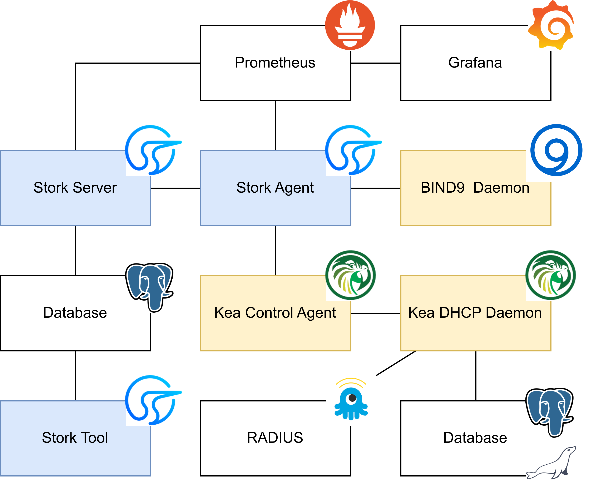
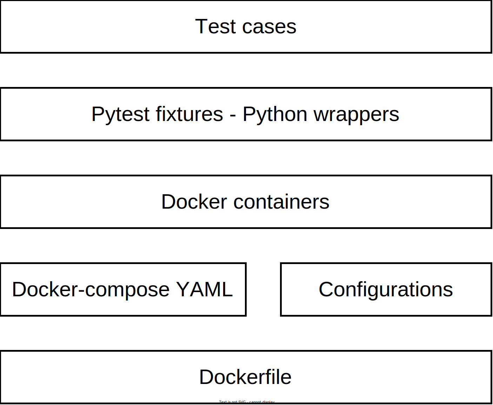

[comment]: # (Set the theme:)
[comment]: # (THEME = white)
[comment]: # (CODE_THEME = shades-of-purple)
[comment]: # (The list of themes is at https://revealjs.com/themes/)
[comment]: # (The list of code themes is at https://highlightjs.org/)

Sławek Figiel | ISC | November 3, 2022

# Stork testing

 <!-- .element: style="height:10vh; max-width:80vw; image-rendering: crisp-edges;" -->

[comment]: # (!!!)

## Agenda

1. Unit tests
2. Static tests
3. System tests
   1. Architecture
   2. Simple test
   3. Configuration management
   4. Features
   5. Missing parts
4. Storybook as test framework
5. Next steps

[comment]: # (!!!)

## Unit tests - Backend

- Written in Golang
- Require Postgres (standalone or in Docker)
- Server / Agent / Database / REST API
- Files with `_test.go` suffix
- Executed by `rake unittest:backend`

[comment]: # (!!!)

### Example

```go [1|2|3-5|7-8|10-12]
// Collector construction fails if interval is missing.
func TestCollectorWithMissingInterval(t *testing.T) {
	// Arrange
	db, _, teardown := dbtest.SetupDatabaseTestCase(t)
	defer teardown()

	// Act
	collector, err := NewCollector(db)

	// Assert
	require.Nil(t, collector)
	require.Error(t, err)
}
```

[comment]: # (!!!)

## Unit tests - Frontend

- Written in TypeScript (Karma & Jasmine)
- Require Chrome
- Frontend logic / UI
- Files with `.spec.ts` suffix
- Executed by `rake unittest:ui`

[comment]: # (!!!)

### Example

```ts [1|3|4-7|9|10|12-13]
// ... some configurations above ...

it('should not open a tab on error', () => {
    spyOn(dhcpApi, 'getHost').and.returnValue(
        throwError({ status: 404 })
    )
    spyOn(messageService, 'add')

    paramMapSubject.next(convertToParamMap({ id: 1 }))
    fixture.detectChanges()

    expect(component.tabs.length).toBe(1)
    expect(messageService.add).toHaveBeenCalled()
})
```

[comment]: # (!!!)

## Static tests

Linting

- `rake lint:backend`
- `rake lint:ui`
- `rake lint:git` (only CI)

Vulnerability checkers

- `npm audit`
- Tool for Go coming soon...
- Github Alerts

[comment]: # (!!!)

## System tests

 <!-- .element: style="height:50vh; max-width:80vw; image-rendering: crisp-edges;" -->

[comment]: # (!!!)

### Architecture

 <!-- .element: style="height:50vh; max-width:80vw; image-rendering: crisp-edges;" -->

[comment]: # (!!!)

### Overview

- Written in Python
- Require Docker
- Real interactions between Stork and Kea/BIND9
- Files in the `tests/system` directory
- Executed by `rake systemtest`

[comment]: # (!!!)

### Example 1

```python [1-2|3|4-6|8|10-12]
def test_search_leases(kea_service: Kea,
                       server_service: Server):
    """Search by IPv4 address."""
    server_service.log_in_as_admin()
    server_service.authorize_all_machines()
    server_service.wait_for_next_machine_states()

    data = server_service.list_leases('192.0.2.1')

    assert data['total'] == 1
    assert data['items'][0]['ipAddress'] == '192.0.2.1'
    assert data['conflicts'] is None
```

[comment]: # (!!!)

### Example 2 (configuration)

```python [1-2|3-4|8|10-11]
@kea_parametrize(
  "agent-kea-tls-optional-client-cert-no-verify")
def test_kea_over_secure_protocol(
  server_service: Server, kea_service: Kea):
    """Check if Stork agent sends requests to Kea over HTTPS."""
    server_service.log_in_as_admin()
    server_service.authorize_all_machines()
    state, *_ = server_service.wait_for_next_machine_states()

    access_point = state['apps'][0]['access_points'][0]
    assert access_point['use_secure_protocol']
    leases = server_service.list_leases('192.0.2.1')
    assert leases['total'] == 1
```

[comment]: # (|||)

### Example 2 (configuration)

docker-compose.yaml:

```yaml [1|2|3-5]
agent-kea-tls-optional-client-cert-no-verify:
  extends: agent-kea
  volumes:
    - $PWD/tests/system/config/kea-tls/optional-client-↵
      cert.json:/etc/kea/kea-ctrl-agent-tls.json
    - $PWD/tests/system/config/certs/cert.pem:/root/certs/cert.pem
    - $PWD/tests/system/config/certs/key.pem:/root/certs/key.pem
    - $PWD/tests/system/config/certs/CA:/root/certs/CA
  environment:
    STORK_AGENT_SKIP_TLS_CERT_VERIFICATION: "true"
```

[comment]: # (|||)

kea-ctrl-agent.json:

```
<?include "/etc/kea/kea-ctrl-agent-tls.json"?>
```

optional-client-cert.json:

```json
"trust-anchor": "/root/certs/CA",
"cert-file": "/root/certs/cert.pem",
"key-file": "/root/certs/key.pem",
"cert-required": false,
```

[comment]: # (|||))

docker-compose.yaml:

```yaml [6-8|9-10]
agent-kea-tls-optional-client-cert-no-verify:
  extends: agent-kea
  volumes:
    - $PWD/tests/system/config/kea-tls/optional-client-↵
      cert.json:/etc/kea/kea-ctrl-agent-tls.json
    - $PWD/tests/system/config/certs/cert.pem:/root/certs/cert.pem
    - $PWD/tests/system/config/certs/key.pem:/root/certs/key.pem
    - $PWD/tests/system/config/certs/CA:/root/certs/CA
  environment:
    STORK_AGENT_SKIP_TLS_CERT_VERIFICATION: "true"
```

[comment]: # (!!!)

### Example 3 (BIND9)

```python [1|4-7|9-10|12]
def test_bind9(server_service: Server, bind9_service: Bind9):
    server_service.log_in_as_admin()
    server_service.authorize_all_machines()
    state, *_ = server_service.
      wait_for_next_machine_states()

    assert state['apps'][0]['type'] == "bind9"

    metrics = { metric.name: metric for metric
        in bind9_service.read_prometheus_metrics() }

    assert metrics["bind_up"].samples[0].value == 1.0
```

[comment]: # (!!!)

### Example 4 (generate traffic)

```python [1-2|7-9|11|12|13-14]
def test_get_kea_stats(server_service: Server,
      kea_service: Kea, perfdhcp_service: Perfdhcp):
    server_service.log_in_as_admin()
    server_service.authorize_all_machines()
    server_service.wait_for_next_machine_states()

    perfdhcp_service.generate_ipv4_traffic(
        ip_address=kea_service.get_internal_ip_address(
          "subnet_00", family=4))

    server_service.wait_for_kea_statistics_pulling()
    data = server_service.overview()

    assert int(data['dhcp4_stats']['assignedAddresses']) > 9
```

[comment]: # (|||)

### Example 4 (network configuration)

docker-compose.yaml:

```yaml [1|3|4|5|6|7-9|13-15]
agent-kea:
  ...
  networks:
    storknet:
      ipv4_address: 172.20.42.100
      priority: 1000
    subnet_00:
      ipv4_address: 172.100.42.100
      priority: 500
    subnet_01:
      ipv4_address: 172.101.42.100
      priority: 400
    subnet6_00:
      ipv6_address: 3000:db8:1:42::100
      priority: 500
```

[comment]: # (!!!)

### Example 5: (CloudSmith package)

```python [2|1|3|3-8|9-10|11-12|13]
@package_parametrize(version="1.0.0")
def test_cloudsmith(package_service: ExternalPackages):
    with package_service.no_validate() as legacy_service:
        legacy_service.log_in_as_admin()
        m = legacy_service.authorize_all_machines()["items"][0]
        state = legacy_service.read_machine_state(m["id"])
        old_version = state["agent_version"]
        assert old_version == "1.0.0"
    package_service.update_agent_to_latest_version()
    package_service.update_server_to_latest_version()
    state = package_service.wait_for_next_machine_states(
      wait_for_apps=False)[0]
    assert state["agent_version"] != old_version
```

[comment]: # (!!!)

### Features

- Supporting Stork Server/Stork Agent/Kea Control Agent/Kea DHCPv4 and v6 Daemons/BIND 9 Daemon/Databases
- Managing services with Python API
- Isolating test cases
- Storing configurations in plain text
- Generating traffic using Perfdhcp
- Collecting log files on failure

[comment]: # (!!!)

### Missing parts

- Only one instance of a specific service may be used in a single test case (HA pair testing)
- Waiting for loading Kea configuration by DHCP Daemon (Kea DHCPv6 Daemon is unstable)
- PyTest output in post-test log files (sic!)
- OpenAPI validates the API contract too strictly
- Some API endpoints in the Server wrapper
- Running system test on different operating systems
- Generating DNS traffic for BIND9
- Diagnostic data for some failure types
- Support for modern `docker compose` command

[comment]: # (!!!)

## Storybook

- Written in TypeScript
- Require Chrome
- Tool to run the UI components in isolation
- Files with the `.stories.ts` suffix
- Executed by `rake storybook`
  
- Exploratory testing
- Visual/regression testing 
- Interaction testing
- Accessibility testing
- Snapshot testing

[comment]: # (!!!)

### Example

From official Storybook website:

<video nocontrols autoplay muted loop width="560" height="315">
  <source src="media/storybook-hero-video-optimized-lg.mp4" type="video/mp4">
</video>

[comment]: # (!!!)

## Next steps

- Extend the system tests API
- E2E UI tests
- Performance / load testing
  - Large WWW traffic
  - Large number of Kea/BIND9 daemons
  - Large Kea configurations
- Fuzzing testing (REST API edge cases)
- Improve performance of system tests

[comment]: # (!!!)

# Q&A

[comment]: # (!!!)
